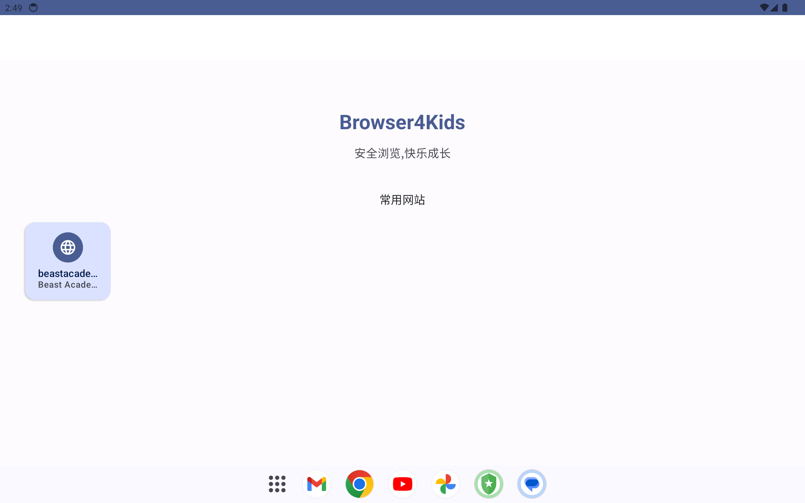
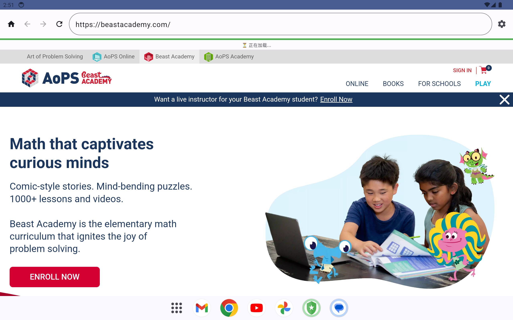
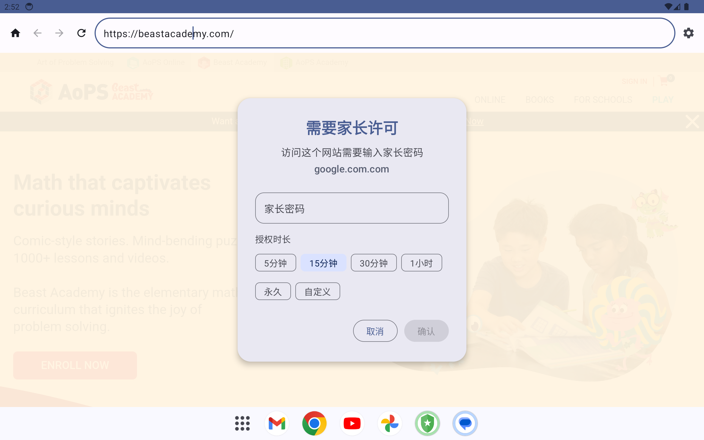

# Browser4Kids

**Browser4Kids** 是一个专为儿童设计的 Android 平板浏览器，通过 URL 白名单和家长密码保护，为孩子提供安全的上网环境。

## 截图

| 主页 | 浏览页 | 访问拦截 |
|:---:|:---:|:---:|
|  |  |  |

## 功能特性

### 儿童浏览
- 基于 WebView 的安全浏览器，仅支持 URL 输入（无搜索功能）
- 主页显示白名单网站快捷方式，一键访问
- 地址栏集成导航按钮（主页 / 后退 / 前进 / 刷新）
- 加载进度条和状态提示

### 访问控制
- **URL 白名单**：支持精确 URL、域名、通配符三种匹配规则
- **密码拦截**：未授权网站弹出家长密码验证
- **限时授权**：解锁时可选 5 分钟 / 15 分钟 / 30 分钟 / 1 小时 / 永久 / 自定义时长，到期自动收回
- **域名级解锁**：授权后同域名所有页面均可访问

### 家长控制（密码保护）
- 白名单规则管理（增删改查）
- 临时授权管理（实时倒计时、手动撤销）
- 访问日志查看和搜索
- 浏览历史记录
- 密码修改和找回
- 推荐网站快速添加（9 个预置儿童友好网站）

### 安全特性
- 密码 SHA-256 哈希存储
- WebView 安全加固（禁用文件访问、禁止混合内容）
- 防截屏保护（FLAG_SECURE）
- 非 HTTP scheme 静默拦截

## 技术栈

| 类别 | 技术 |
|---|---|
| 语言 | Kotlin |
| UI | Jetpack Compose + Material Design 3 |
| 浏览器 | Android WebView |
| 数据库 | Room |
| 配置存储 | SharedPreferences |
| 架构 | MVVM |
| 构建 | Gradle 8.5 / AGP 8.2.2 / Kotlin 1.9.22 |
| 测试 | JUnit4 / Robolectric / MockK |

## 系统要求

- Android 8.0+ (API level 26)
- 推荐 7-12 英寸平板设备

## 构建

```bash
# 设置 JDK 17
export JAVA_HOME=/path/to/jdk17

# Debug 构建
./gradlew assembleDebug

# 运行测试
./gradlew test

# APK 位于
# app/build/outputs/apk/debug/app-debug.apk
```

## 项目结构

```
app/src/main/java/com/browser4kids/
├── Browser4KidsApp.kt          # 应用主入口 Composable
├── Browser4KidsApplication.kt  # Application 类
├── MainActivity.kt             # Activity
├── data/
│   ├── database/               # Room DAO (WhitelistDao, AccessLogDao, BrowsingHistoryDao)
│   └── model/                  # 数据实体 (WhitelistRule, AccessLog, BrowsingHistory)
├── repository/                 # 数据仓库层
├── ui/
│   ├── browser/                # 浏览器界面 (BrowserScreen, WebViewClient)
│   ├── password/               # 密码对话框 (含授权时长选择)
│   ├── settings/               # 家长设置界面
│   ├── welcome/                # 首次启动引导
│   └── theme/                  # Material Design 3 主题
├── util/                       # 工具类 (UrlMatcher, AccessControlManager, PasswordManager)
└── viewmodel/                  # ViewModel (BrowserViewModel, SettingsViewModel)
```

## License

MIT
